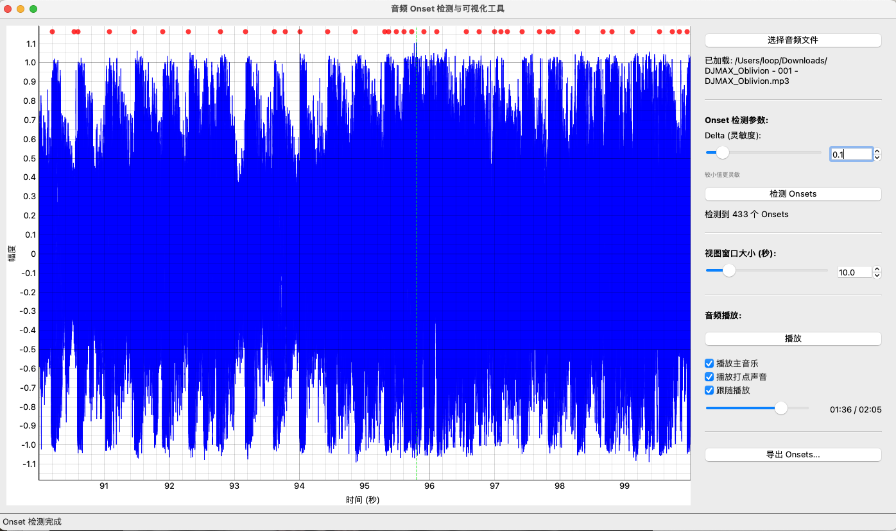

# 音频 Onset 检测与可视化工具

[](https://opensource.org/licenses/MIT)

一个基于 Python 和 Qt 的音频 onset (起音点)检测和可视化工具。支持多种音频格式,提供实时波形显示、onset 标记、打点音轨生成等功能。

## 界面预览



## 功能特点

- 支持多种音频格式 (WAV, MP3, AAC, FLAC)
- 实时波形可视化显示
- 可调节的 onset 检测参数
- 可视化 onset 标记
- 生成打点音轨并同步播放
- 支持导出 onset 时间数据 (TXT/CSV)
- 可调节视图范围
- 播放进度跟随功能
- 主音轨和打点音轨独立音量控制

## 安装要求

- Python 3.7+
- PySide6
- NumPy
- librosa
- pyqtgraph
- soundfile

可以通过以下命令安装依赖:

```bash
pip install PySide6 numpy librosa pyqtgraph soundfile
```

## 使用方法

1. 运行程序:
```bash
python onset_gui.py
```

2. 使用界面:
   - 点击"打开文件"选择音频文件
   - 调整 delta 参数进行 onset 检测
   - 使用播放控制器播放/暂停音频
   - 可选择是否播放主音轨或打点音轨
   - 调整视图持续时间以改变显示范围
   - 使用导出功能保存检测结果

## 主要参数说明

- **Delta**: onset 检测的灵敏度参数,值越小检测越敏感
- **视图持续时间**: 波形显示的时间范围(秒)
- **跟随播放**: 启用后视图会自动跟随播放位置

## 导出功能

支持以下导出格式:
- TXT 格式: 每行一个时间点
- CSV 格式: 逗号分隔的时间点
- 可选择导出当前视图或全部数据

## 许可证

本项目采用 MIT 许可证。

## 贡献指南

欢迎提交 Issue 和 Pull Request 来帮助改进这个项目。

## 致谢

本项目使用了以下开源库:
- PySide6 (Qt for Python)
- librosa (音频处理)
- pyqtgraph (数据可视化)
- NumPy (数值计算)
- soundfile (音频文件处理)
